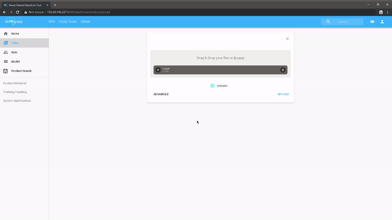

<h1 align="center">
Hysia Video to Online Platform
</h1>

<sub>* This project is supported by 
[Cloud Application and Platform Lab](https://wiki.withcap.org) 
led by [Prof. Yonggang Wen](https://www.ntu.edu.sg/home/ygwen/)</sub>  

An intelligent multimodal-learning based system for video, product and ads analysis. You can build various downstream 
applications with the system, such as product recommendation, video retrieval. Several examples are provided.

**V2** is under active development currently. You are welcome to create a issue, pull request here. We will credit them
into V2.


<p align="center">
  <a href="#showcase">Showcase</a> •
  <a href="#features">Features</a> •
  <a href="#setup-environment">Setup Environment</a> •
  <a href="#configuration">Configuration</a> •
  <a href="#demo">Demo</a> •
  <a href="#credits">Credits</a> •
  <a href="#about-us">About Us</a>
</p>

## Showcase

:point_right: Full list of [showcase](docs/Showcase.md).

<ol>
<li> Upload video and process it by selecting different models  



</li>

<li> Display video processing result  
    


</li>

<li> Search scene by image and text
    


</li>

<li> Insert product advertisement and display insertion result
    


</li>

</ol>

## Features

- Multimodal learning-based video analysis:
    - Scene / Object / Face detection and recognition
    - Multimodality data preprocessing
    - Results align and store
- Downstream applications:
    - Intelligent ads insertion
    - Content-product match
- Visualized testbed
    - Visualize multimodality results
    - Can be installed seperatelly

## Setup Environment

### 1. Download Data

:point_right: For [:x: no Google Drive access](CONTRIBUTING.md#1-download-data).

```shell script
# Make sure this script is run from project root
bash scripts/download-data.sh
```

### 2. Installation

:point_right: Run with Docker :whale:

The following command will pull the image [`hysia/hysia:v2o`](https://hub.docker.com/r/hysia/hysia/tags) automatically
 if it doesn't exist on your local machine.

```shell script
docker run --gpus all -d -p 8000:8000 hysia/hysia:v2o
```

Visit the following address and use `username=admin`, `password=admin` for login: http://localhost:8000


## Configuration

<ul>
<li> Decode hardware:  

Change the configuration [here](server/HysiaREST/settings.py) at last line:  
```python
DECODING_HARDWARE = 'CPU'
```
Value can be `CPU` or `GPU:<number>` (e.g. `GPU:0`)
</li>
<li> ML model running hardware:

Change the configuration of model servers under this [directory](server/model_server):
```python
import os

# Custom request servicer
class Api2MslServicer(api2msl_pb2_grpc.Api2MslServicer):
    def __init__(self):
        ...
        os.environ['CUDA_VISIBLE_DEVICES'] = '0'
```
A possible value can be your device ID `0`, `0,1`, ...

</li>
</ul>

## Demo
```shell script
cd server

# Start model server
python start_model_servers.py

# Run Django
python manage.py runserver 0.0.0.0:8000
```

Then you can go to http://localhost:8000. Use username: admin and password: admin to login.

## Some Useful Tools

- Large dataset preprocessing
- Video/audio decoding
- Model profiling
- Multimodality data testbed

## Credits

Here is a list of models that we used in Hysia-V2O. 

| Task                  | Model Name                  | License    | GitHub Repo |
| --------------------- |:---------------------------:|:----------:|:-----------:|
| MMDetection           |                             |            |             |
| Object detection      |                             | Apache-2.0 | [TensorFlow detection model zoo] |
|                       | [SSD MobileNet v1 COCO]     |            |             |
|                       | [SSD Inception v2 COCO]     |            |             |
|                       | [FasterRCNN ResNet101 COCO] |            |             |
| Scene Recognition | | |
| Audio Recognition | | |
| Image Retrieval | | |
| Face Detection | | |
| Face Recognition | | |
| Text Detection| | |
| Text Recognition| | |

## Contributing

You are welcome to contribute to Hysia! Please refer to [here](CONTRIBUTING.md) to get start.

## Paper Citation

Coming soon!


## About Us

### Maintainers
- Huaizheng Zhang [[GitHub]](https://github.com/HuaizhengZhang)
- Yuanming Li [[GitHub]](https://github.com/YuanmingLeee)
- Qiming Ai [[GitHub]](https://github.com/QimingAi)
- Shengsheng Zhou [[GitHub]](https://github.com/ZhouShengsheng)

### Previous Contributors
- Wenbo Jiang (Now, Shopee) [[GitHub]](https://github.com/Lancerchiang)
- Ziyuan Liu (Now, Tencent) [[GitHub]](https://github.com/ProgrammerYuan)
- Yongjie Wang (Now, NTU PhD) [[GitHub]](https://github.com/iversonicter)


[Tensorflow detection model zoo]: https://github.com/tensorflow/models/blob/master/research/object_detection/g3doc/detection_model_zoo.md
[SSD MobileNet v1 COCO]: http://download.tensorflow.org/models/object_detection/ssd_mobilenet_v1_coco_2018_01_28.tar.gz
[SSD Inception v2 COCO]: http://download.tensorflow.org/models/object_detection/ssd_inception_v2_coco_2018_01_28.tar.gz
[FasterRCNN ResNet101 COCO]: http://download.tensorflow.org/models/object_detection/faster_rcnn_resnet101_coco_2018_01_28.tar.gz

